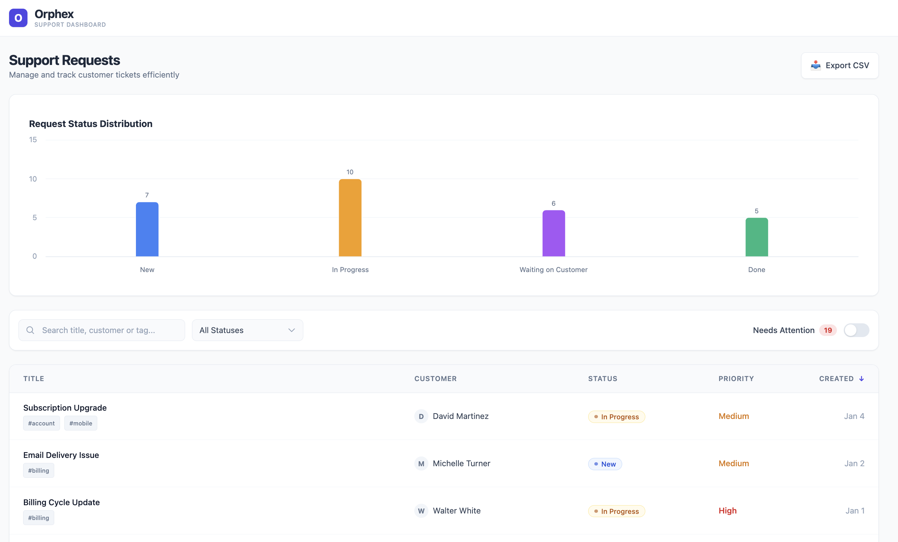
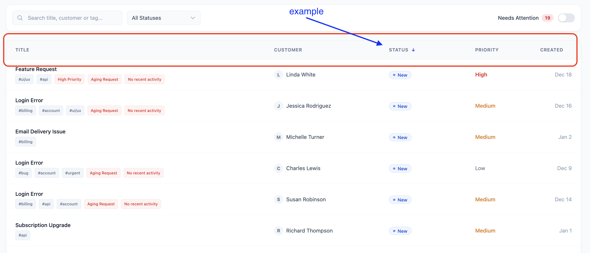
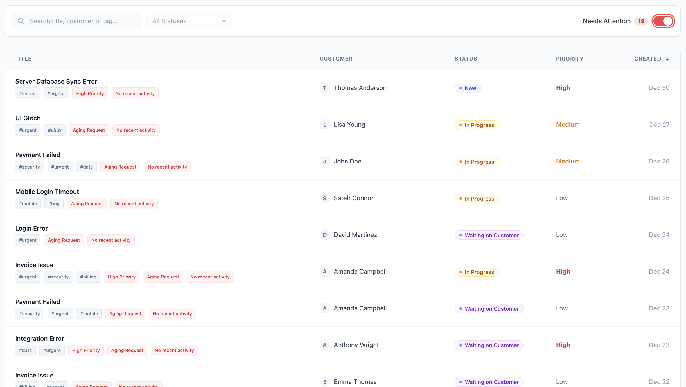
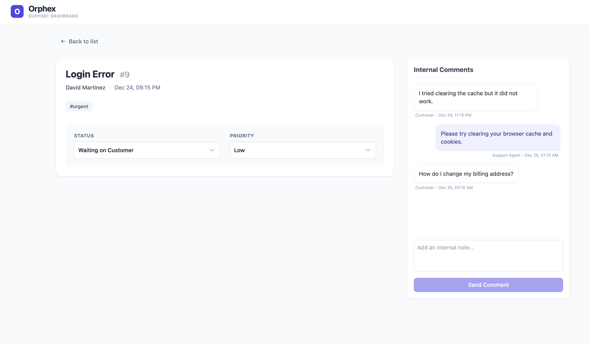

# Orphex Support Dashboard

A modern, accessible, and type-safe Customer Support Dashboard application built with **Vue 3** and **TypeScript**. This project allows support agents to track, filter, and manage customer tickets efficiently.


## 🚀 Features

* **Intelligent Dashboard:** A clean, paginated interface for high-volume support request management.

* **State-Aware URL Synchronization:** Advanced filtering and searching (text, customer, or tags) that stay perfectly in sync with the URL, enabling shareable and refresh-proof dashboard states.

* **Contextual Reasoning Engine:** A smart "Needs Attention" system that goes beyond simple flagging. It analyzes ticket data to provide dynamic reasoning labels (e.g., Critical Aging, Agent Inactivity), helping agents prioritize based on actionable insights.

* **Smart CSV Export:** Professional client-side report generation that reflects the exact current view of the table, preserving all active filters, search results, and complex sorting orders.

* **Bi-directional Multi-Column Sorting:** Toggle sorting by Date, Priority, or Status with weight-based logic to ensure the most critical items always surface correctly.

* **Data Visualization:** Real-time request distribution analysis using interactive Highcharts.

* **Deep-Dive Request Detail:** Comprehensive view for request history, internal agent-only comment system, and instant status/priority updates.

* **Persistent Data Layer:** All interactions, status changes, and internal notes are persisted via LocalStorage, ensuring no data loss between sessions.

## 🛠 Tech Stack

* **Framework:** Vue 3 (Composition API / Script Setup)
* **Language:** TypeScript
* **State Management:** Pinia
* **Styling:** Tailwind CSS
* **Testing:** Vitest
* **Charting:** Highcharts Vue
* **Date Handling:** date-fns

## 📂 Project Structure
```
src/
├── assets/          # Static assets
├── components/      # Reusable UI components
│   ├── common/      # Generic components (Badge, Toast, etc.)
│   ├── dashboard/   # Dashboard specific components (Table, Filters)
│   └── request/     # Detail view components (Chat, InfoCard)
├── composables/     # Shared logic (useToast, etc.)
├── constants/       # App-wide constants (Statuses, Priorities)
├── router/          # Vue Router configuration
├── stores/          # Pinia stores (RequestStore)
├── tests/           # Unit tests (Logic & Store)
├── types/           # TypeScript interfaces
├── utils/           # Helper functions (Mock data generator, Logic)
├── views/           # Main page views
└── App.vue          # Root component
```

## 🛡️ Data Integrity & Immutability Strategy

To ensure data reliability and prevent side effects during sorting/filtering operations, the application strictly adheres to **immutability principles**:

* **Single Source of Truth:** The application state is managed centrally via **Pinia**. The `requests` array in the store is never mutated directly by UI components.
* **Defensive Copying:** In `computed` properties (like `filteredRequests`), we strictly use the **spread operator** (`[...requests]`) to create a shallow copy of the dataset before applying methods like `.sort()`.
* **Reasoning:** Since JavaScript's `Array.prototype.sort()` mutates the array in-place, sorting the original state directly would cause irreversible order changes and inconsistent UI behavior. Working on a copy ensures the master dataset remains pristine.

## ♿ Accessibility

This project was built with a "Privacy & Accessibility First" mindset. Key accessibility features include:

* **Semantic HTML:** Proper use of `<header>`, `<main>`, `<section>`, `<ul>`, and heading hierarchy (`h1`-`h3`).
* **Screen Reader Support:**
    * `aria-labels` for icon-only buttons (e.g., "Go back to dashboard").
    * `sr-only` labels for form inputs (Search, Select).
    * `role="switch"` for the "Needs Attention" toggle with `aria-checked` states.
    * `aria-hidden="true"` for decorative icons to reduce noise.
* **Keyboard Navigation:**
    * Full focus management on interactive elements.
    * Sortable table headers are keyboard accessible (`Tab` + `Enter`).
* **Live Regions:** Toast notifications use `role="alert"` to announce success/error messages immediately.

## 🧪 Testing

Unit tests are written using **Vitest**. The test suite covers:

* **Business Logic:** Verifying the "Needs Attention" algorithm (e.g., ensuring high-priority inactive tickets are flagged).
* **State Management:** Testing Pinia actions, getters, search filtering, and sorting logic.

To run the tests:
```bash
yarn test
```

## 📦 Installation & Setup

This project uses **Yarn** as the package manager.

1.  **Clone the repository:**
    ```bash
    git clone [https://github.com/your-username/orphex-support-dashboard.git](https://github.com/your-username/orphex-support-dashboard.git)
    cd orphex-support-dashboard
    ```

2.  **Install dependencies:**
    ```bash
    yarn install
    ```

3.  **Run the development server:**
    ```bash
    yarn dev
    ```

4.  **Run Unit Tests:**
    ```bash
    yarn test
    ```

5.  **Build for Production:**
    ```bash
    yarn build
    ```

## 🚀🛠️  Future Improvements & Roadmap
* **Comprehensive Testing Suite (Unit & E2E):** While core logic is tested, I would increase coverage by adding Playwright for End-to-End testing.

* **Advanced Data Visualization:** I would implement a "Drill-down" feature in Highcharts, allowing agents to click on chart segments to instantly filter the table by that specific status or priority.

* **Performance Optimization for Large Scales:** Implement Virtual Scrolling or Dynamic Lazy Loading to ensure the dashboard maintains its "lightning-fast" performance even when handling tens of thousands of support requests.

* **Advanced Comment Management:** Expand the internal chat simulation to allow agents to edit or delete their own notes.

* **Advanced Theming (Dark & Light Mode):** I would implement a robust, system-aware Dark/Light Mode toggle using Tailwind CSS or CSS Variables.

## 🖼️ Screenshots

### Dashboard View

*A high-level overview featuring real-time status distribution and a unified space for managing requests with at-a-glance indicators.*

----


*Clickable table headers for instant, weight-based sorting by status, priority, or date.*

----


*Instantly isolate tickets that need immediate action. The 'Needs Attention' toggle hides the noise and shows exactly what to focus on and why.*

----

### Detail View

*In-Depth Ticket Management: A dedicated workspace for deep-diving into ticket history, managing internal agent communications, and performing instant status or priority transitions.*
